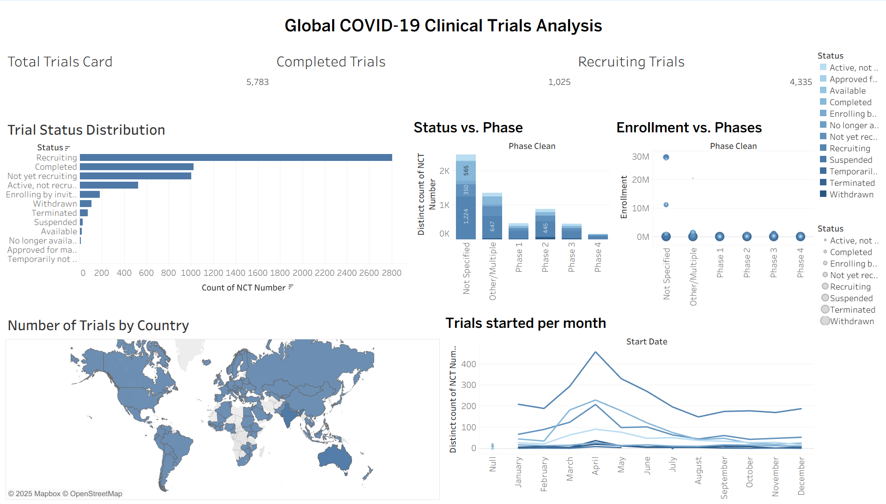

# 🩺 COVID-19 Clinical Trials Analysis – EDA, Machine Learning & Dashboard

This project provides a **complete end-to-end data analysis pipeline** of global COVID-19 clinical trials, combining **Exploratory Data Analysis (EDA)**, **Machine Learning**, **SQL queries**, and **interactive data visualization** with Tableau. It aims to deliver valuable insights for researchers, policymakers, and healthcare professionals to understand the trends, patterns, and progress of COVID-19 research worldwide.

---

## 📊 Overview

The data is sourced from [ClinicalTrials.gov](https://clinicaltrials.gov/), a global database of privately and publicly funded clinical studies.  
This project explores the data to uncover:

- Trial status distributions and phase progressions  
- Participant enrollment trends  
- Country-wise research activity  
- Timeline analysis of clinical trial initiation  
- Predictive modeling of trial statuses using machine learning  

---

## 🎯 Objectives

- Perform thorough **data cleaning** and **EDA** to understand the structure and insights of COVID-19 clinical trials.  
- Visualize **trial phases, enrollment, status, and geographic distribution**.  
- Analyze **trends over time** in global research activity.  
- Build a **Random Forest model** to predict the trial status.  
- Create a **Tableau dashboard** for easy visualization and storytelling.

---

## 🧰 Tech Stack

| Tool / Library | Purpose |
|---------------|----------|
| **Python (Pandas, NumPy, Seaborn, Matplotlib)** | Data Cleaning & EDA |
| **Scikit-learn** | Machine Learning |
| **SQL** | Query-based data analysis |
| **Tableau / Excel** | Data visualization |
| **Jupyter Notebook** | Development environment |

---

## 📊 Key Insights

- Most clinical trials are in the **"Completed"** phase, reflecting successful research completion.  
- **United States, France, UK, Italy, and Spain** contributed the majority of trials globally.  
- Participant enrollment patterns vary significantly across different phases.  
- The timeline analysis shows a **spike in new trials** during major COVID-19 waves.  
- A **Random Forest classifier** achieved ~56% accuracy in predicting trial status.

---

## 📈 Dashboard Preview

An interactive dashboard was created using **Tableau**, presenting:

- Distribution of trial statuses  
- Enrollment by phase  
- Country-wise trial counts  
- Timeline of clinical trial initiation  



---

## 📦 Installation & Usage

### 1️⃣ Clone this repository
```bash
git clone https://github.com/your-username/covid19-clinical-trials-analysis.git
cd covid19-clinical-trials-analysis

2️⃣ Create a virtual environment (optional but recommended)
python -m venv venv
source venv/bin/activate   # On Windows: venv\Scripts\activate

3️⃣ Install dependencies
pip install -r requirements.txt

4️⃣ Run the notebook
jupyter notebook analysis_and_model.ipynb

📚 Dataset

Source: ClinicalTrials.gov

Direct Download: Dataset Link

⚠️ Note: The full dataset is large and not included in this repository. Please use the link above to download and place it in the data/ folder.

🏁 Results

Cleaned and processed 5783 clinical trials with 25+ features

Built a Random Forest model achieving ~56% accuracy

Identified key trends in research activity, demographics, and outcomes

Built a Tableau dashboard summarizing the most impactful insights

🤝 Contributing

Contributions are welcome!
To contribute:

Fork the repository

Create a feature branch (git checkout -b feature-name)

Commit your changes (git commit -m "Add feature")

Push to the branch (git push origin feature-name)

Open a Pull Request

📜 License

This project is licensed under the MIT License
.

🙏 Acknowledgements

ClinicalTrials.gov
 for providing publicly available data.

All researchers and contributors working on COVID-19 research worldwide.

Project inspired by the need to analyze and visualize the landscape of global clinical research.
